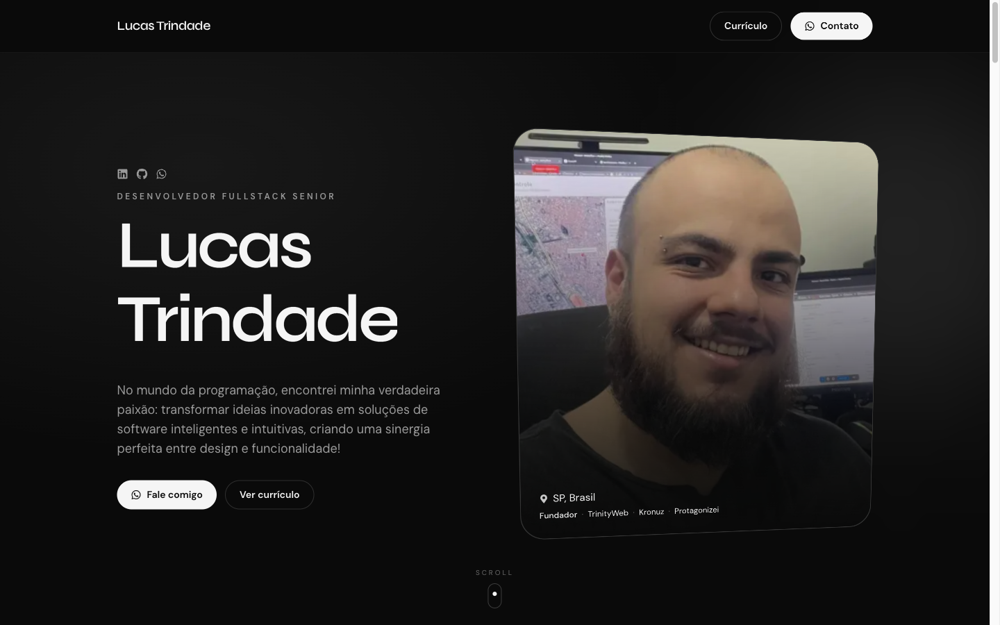

# LucasTrindade.dev

Portfolio pessoal de **Lucas Trindade** — Full Stack Developer.  
Construído com **Next.js**, conteúdo gerenciado via **Notion** e animações com **GSAP**.

<div align="center">
  
</div>

## Stack

- [Next.js 15](https://nextjs.org/) (Pages Router + ISR)
- [React 19](https://react.dev/)
- [Tailwind CSS](https://tailwindcss.com/)
- [GSAP](https://gsap.com/) + ScrollTrigger
- [Notion API](https://developers.notion.com/) como CMS
- [Vercel](https://vercel.com/) para deploy

## Funcionalidades

- **CMS com Notion** — perfil, skills, experiências, certificados e projetos vêm de databases no Notion, com revalidação ISR.
- **Hero interativo** — tilt 3D da foto (mouse + idle), parallax no scroll e quote overlay.
- **Certificados** — cards com overlays, viewer com navegação, previews, dados formatados e “há X dias”.
- **Projetos** — prints ultrawide, item ativo em cor (demais em P&B), blur em degradê e overlays de CTA.
- **Skills** — marquee com tooltips.
- **Mock local** — se o Notion falhar/vier vazio, o site usa dados mock para desenvolvimento (`USE_MOCK_DATA=true` força o mock).

## Desenvolvimento

```bash
# Requisitos: Node 20+ e Yarn 4
yarn install
cp .env.example .env   # preencha NOTION_TOKEN / NSM_*

yarn dev
```

### Variáveis de ambiente

| Variável | Descrição |
| --- | --- |
| `NOTION_TOKEN` | Token da integração Notion |
| `NSM_TOKEN` / `NSM_URL` | Sync de mídias do Notion |
| `USE_MOCK_DATA` | `true` para forçar mocks locais |

## Scripts

```bash
yarn dev      # desenvolvimento
yarn build    # build de produção
yarn start    # servir build
yarn lint     # ESLint
```

## Estrutura relevante

```
src/
  components/     # UI (Hero, Certificates, PersonalProjects, …)
  data/mockHome.ts
  lib/            # GSAP, fetchHomeData
  pages/          # rotas Next + APIs Notion
public/images/screenshots/
```

## Deploy

O projeto é otimizado para a Vercel. Alterações no Notion refletem após a revalidação do ISR (ou um novo deploy).

---

© Lucas Trindade · [lucastrindade.dev](https://lucastrindade.dev)
